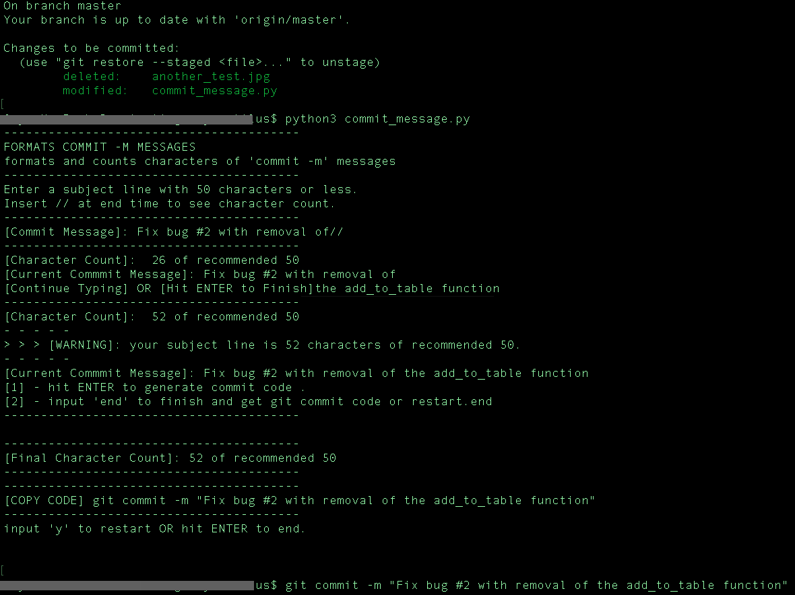

# FORMAT BRIEF COMMITS

Smoothly format and create messages as per Github standards for ```git commit -m ```
+ Retrieve character count by using // at any time: ```Fix latest bug//```
+ Copy and paste generated code ```git commit -m "your commit message will go here"```


## Installation
[1] - Download via git:
```bash
git clone git://github.com/oxynatuilus/name-of-your-project.git
can put some more code here if I like
```


## Usage
1. Open terminal/bash/bash
2. Change into cloned directory:
```bash
cd program_folder_name
```
3. Run python script: 
```bash
python3 commit_message.py
```
4. Exit script by pressing ```ctrl + c```


## Program screnshot.



